# Evidencias TDD — Vota Dolores Hidalgo

Capturas del ciclo **ROJO → VERDE → REFACTOR** de cada ronda del manual. Cada paso tiene además su propio commit en el historial del repositorio (`git log --oneline`).

## Rondas TDD

| # | Ronda | Fase | Qué demuestra |
|---|---|---|---|
| 01 | 1 — Registrar un voto válido | 🔴 ROJO | La prueba falla porque `ServicioVotacion` todavía no existe. |
| 02 | 1 — Registrar un voto válido | 🟢 VERDE | Código mínimo (con `opcion!`, frágil a propósito). |
| 03 | 2 — Opción inexistente | 🔴 ROJO | `Null check operator used on a null value`: el `!` truena. |
| 04 | 2 — Opción inexistente | 🟢 VERDE | Se reemplaza el `!` por una validación que regresa `opcionInvalida`. |
| 05 | 3 — Voto duplicado | 🔴 ROJO | El segundo voto del mismo usuario se acepta como `exitoso`. |
| 06 | 3 — Voto duplicado | 🟢 VERDE | Se registra quién votó en el `Set votantes`. |
| 07 | 4 — Porcentajes | 🔴 ROJO | `obtenerResultados()` no existe. |
| 08 | 4 — Porcentajes | 🟢 VERDE | Porcentajes correctos y 0 % sin votos (sin `NaN`). |
| 09 | 5 — Ganador | 🔴 ROJO | `determinarGanador()` no existe. |
| 10 | 5 — Ganador | 🟢 VERDE | Regresa todas las opciones con el máximo de votos. |
| 11 | 6 — Empate | 🟢 VERDE directo | Pasa sin código nuevo; se conserva como protección. |
| 12 | 7 — Votación cerrada | 🔴 ROJO | Un voto en una votación cerrada en el 2000 se acepta. |
| 13 | 7 — Votación cerrada | 🟢 VERDE | Se valida la fecha de cierre antes que todo. |
| 14 | 8 — Refactor | 🔵 REFACTOR | Guard clauses con nombres descriptivos (`yaCerro`, `yaVoto`). |
| 15 | 8 — Refactor | 🔵 REFACTOR | Las 9 pruebas siguen pasando: el comportamiento no cambió. |
| 16 | Integración | 🟢 VERDE | Plebiscito completo con intento de voto duplicado. |

## Interfaz gráfica animada

| # | Pantalla | Qué demuestra |
|---|---|---|
| 17 | Inicial | Las 4 opciones en 0 %. |
| 18 | Resultado sin votos | El sistema reconoce el empate en lugar de elegir una opción al azar. |
| 19 | Después de votar | Barras animadas con `TweenAnimationBuilder`; los botones de votar desaparecen. |
| 20 | Ganador | Diálogo con animación de escala (`Curves.elasticOut`) y desvanecido. |

## Reto de extensión: reloj inyectado

| # | Fase | Qué demuestra |
|---|---|---|
| 21 | 🔴 ROJO | Las pruebas con reloj falso fallan: `No named parameter with the name 'reloj'`. |
| 22 | 🟢 VERDE | `ServicioVotacion` acepta un `reloj` (por defecto `DateTime.now`). Pasan las 14 pruebas. |

## Checklist del manual (sección 7)

| ✓ | Verificación | Dónde se cubre |
|---|---|---|
| ✅ | Cada regla de negocio tiene su propia prueba | Voto único (R3), opción válida (R2), fecha de cierre (R7), empates (R6) |
| ✅ | `ResultadoVoto` se usa para casos esperados, sin excepciones | `lib/logica/resultado_voto.dart` y `registrarVoto()` |
| ✅ | `obtenerResultados()` no divide entre cero sin votos | Prueba *"si no hay ningun voto, todos los porcentajes son 0"* (R4) |
| ✅ | `VotacionScreen` no duplica reglas de negocio | Solo llama a `ServicioVotacion` |
| ✅ | Prueba de integración con intento de voto duplicado | Prueba *"simulacion completa"* (16) |

## Capturas

### Ronda 1
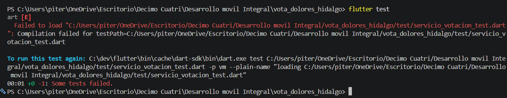
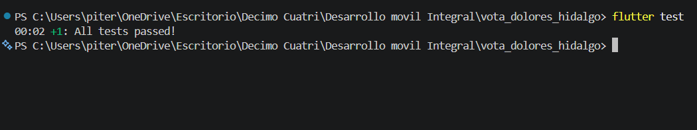

### Ronda 2
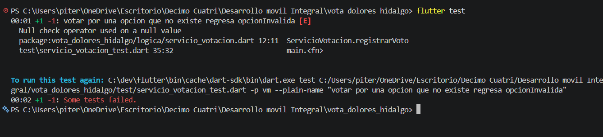
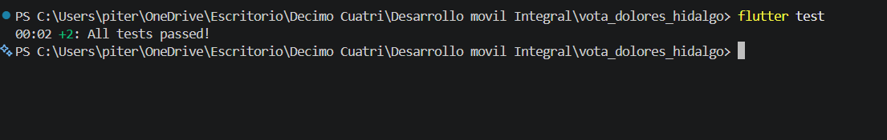

### Ronda 3
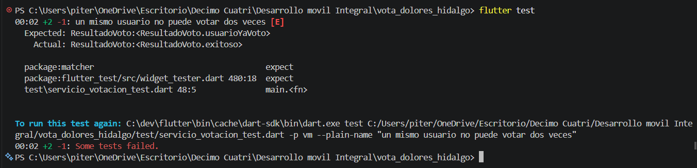
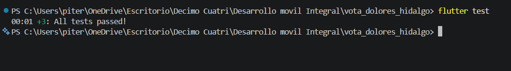

### Ronda 4
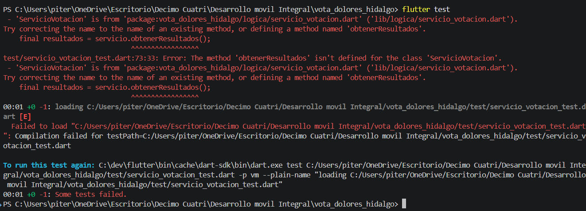
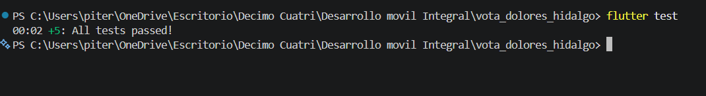

### Ronda 5
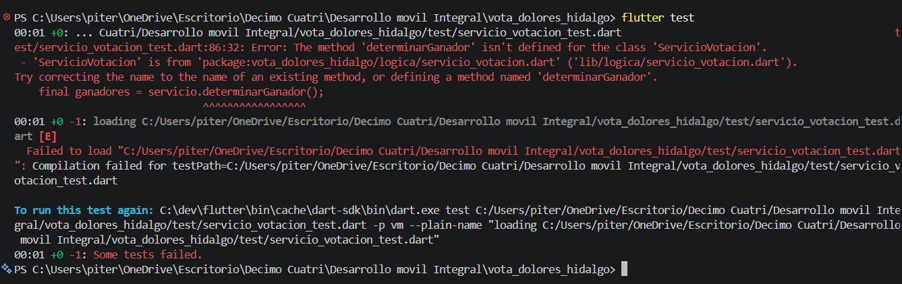
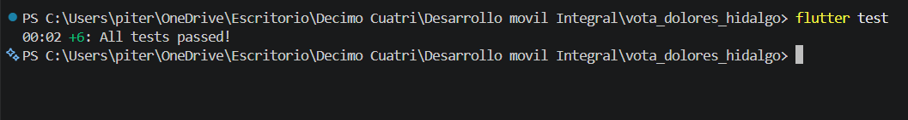

### Ronda 6
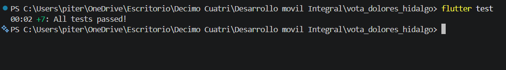

### Ronda 7
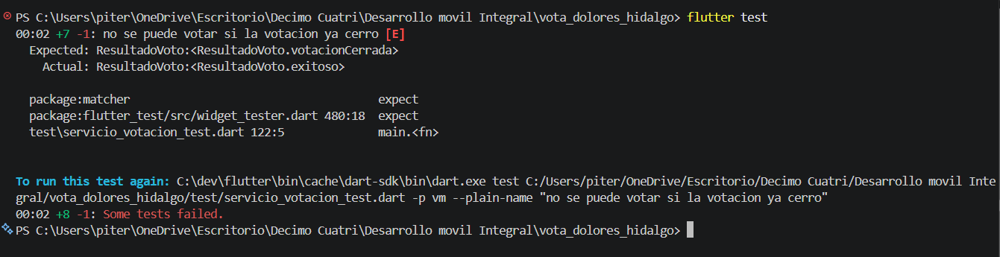
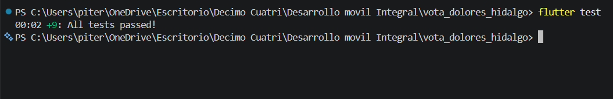

### Ronda 8 — Refactor
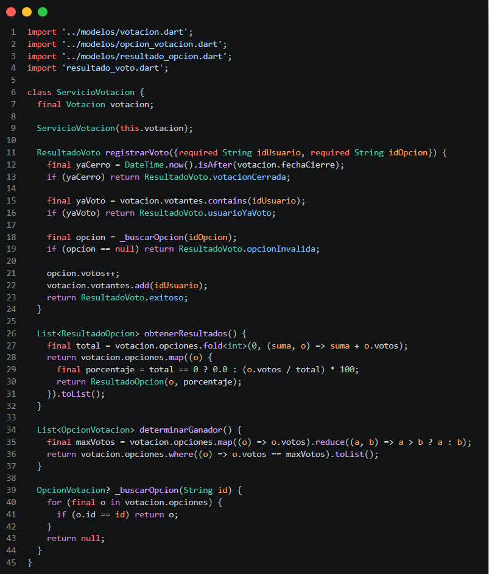
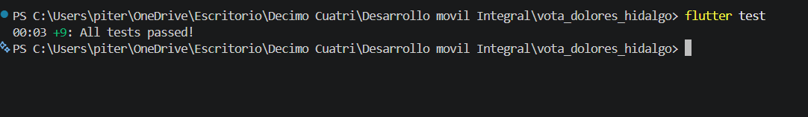

### Prueba de integración
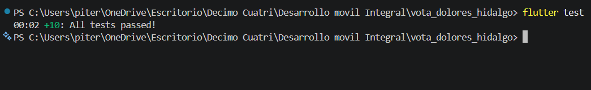

### Interfaz

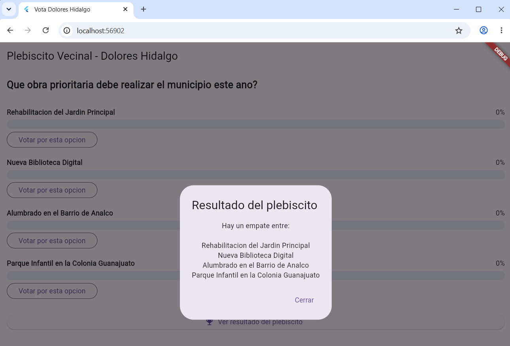
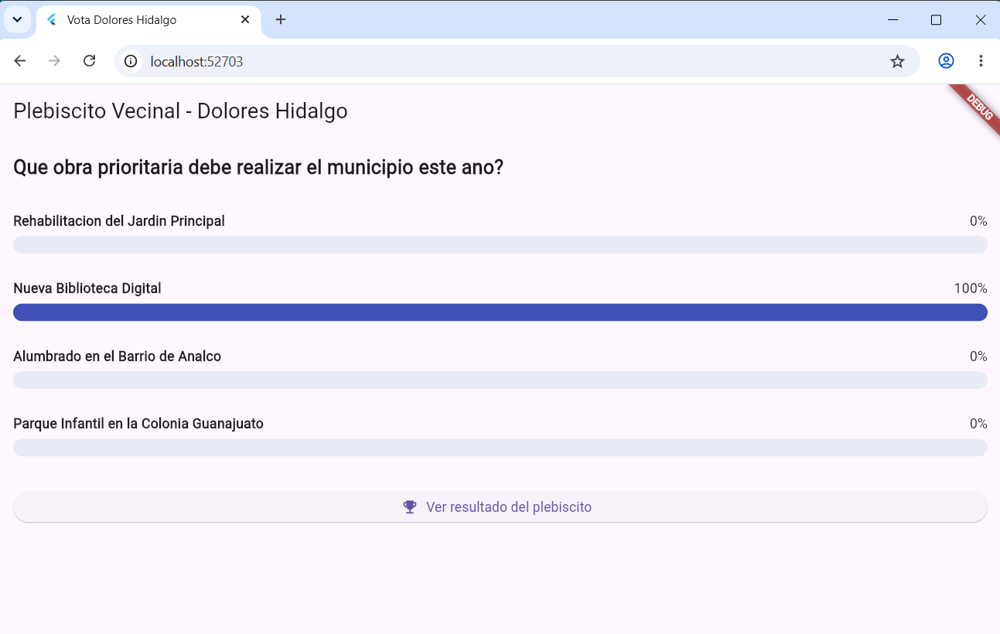
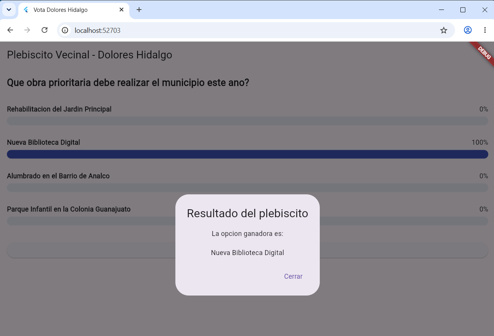

### Reto: reloj inyectado
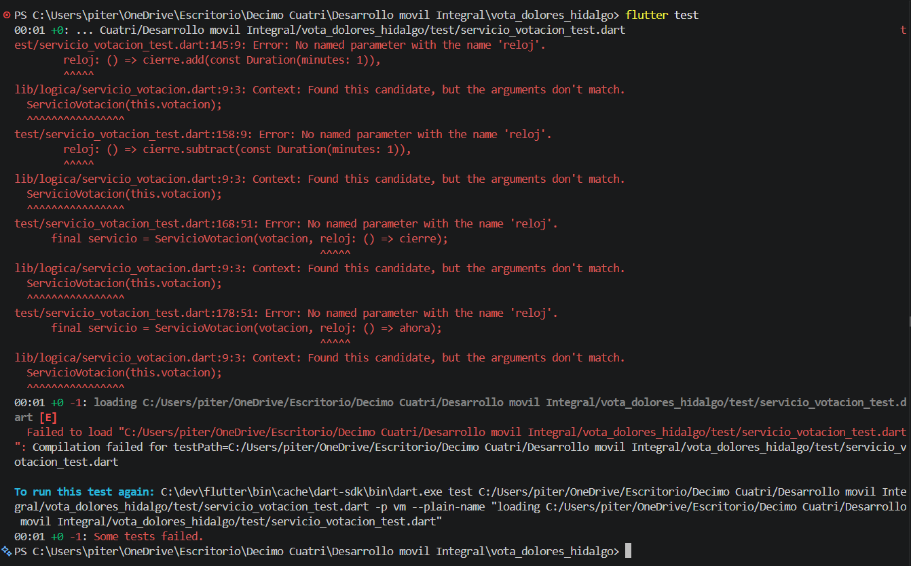
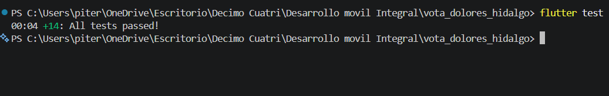
